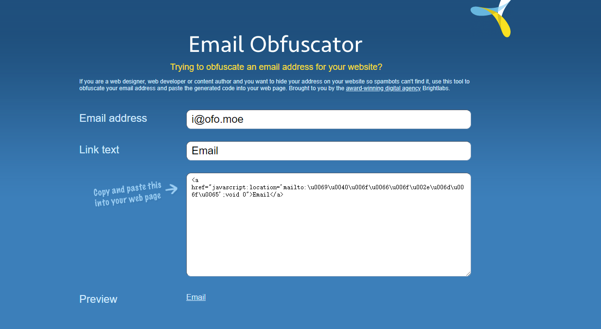

子在川上，逝者斯夫；非常之年，寸阴是竞。不觉间半年过去了，来做个总结吧。

(Illustration by [Stories by Freepik](https://stories.freepik.com/))

## Blog 2020 上半年时间线

### 2020-02-05

购买了 ofo.moe 域名，和某个知名共享单车品牌没有任何关系，纯粹是觉得这个像 Emoji 一样的词很有意思。原本想购买形似 omo.moe、ouo.moe 的域名，可惜均被注册，后来才改用现在的域名。（还是好想要 omo.moe 啊！）

### 2020-02-06

用根域名做了一个[收集英文 Emoji 的站点](https://ofo.moe)。还没有开始使用 [Gatsby](https://www.gatsbyjs.org/)，自己手动抄下来了一个 Gatsby 主题，并修改为 AMP HTML，可惜现在已经搁置好久了。

### 2020-02-28

仿照某个国外网站以及果壳任意门，做了一个「[网站任意门](https://gate.ofo.moe)」，点击按钮可以随机跳转一个奇奇怪怪的网站，或是很有意思，或是非常无聊，既有在线工具，也有学习网站。

### 2020-03-14

移植了一个 Wordpress 主题到 Gridea，定名为 [**Gridea Theme InlineAMP**](https://github.com/jiansing/gridea-theme-inlineamp)。开始使用 Gridea 写 Blog。

### 2020-03-22

「[网站任意门](https://gate.ofo.moe)」被「有趣网址之家」收录。

### 2020-04-06

正式使用 blog.ofo.moe 域名建立了 blog。

### 2020-04-08

[给部署在 Netlify 上的站点添加了完备的 HTTP security headers 增强安全性](https://blog.ofo.moe/add-security-header-on-netlify)，将 ofo.moe 与「[网站任意门](https://gate.ofo.moe)」都迁移到了 netlify.com，DNS 也改用了 netlify.com 的，然而速度似乎还不如 CloudFlare，最后因重新迁移复杂而放弃了迁移回 CloudFlare 的想法。然而忘记了给根域名配置 HTTP security headers，导致后来 [HSTS 预载被删除](https://twitter.com/iwyifan/status/1266661702445133826)。

### 2020-04-13

[用 Power Automate 给自己的 Blog 整了一个邮件订阅服务](https://blog.ofo.moe/use-microsoft-power-automate-to-build-an-rss-mail-subscription-service)。

### 2020-04-21

由于微博某博主的安利，「[网站任意门](https://gate.ofo.moe)」爆增了 22 万的访问用户。

### 2020-05-02

把收藏夹里的[几个很棒的插图库](https://blog.ofo.moe/free-vector-illustration-material-library)找了出来，写了篇文章简单总结了一遍。

### 2020-05-30

更新了 About 页面，处理了重新申请 HSTS 预载等杂务。

顺带将 Email 地址由原先的以图片方式显示更改为 javascript 混淆，点击就可以跳转 mailto 链接。

在线混淆工具：http://www.email-obfuscator.com/

下半年也要迎风奔跑呀。