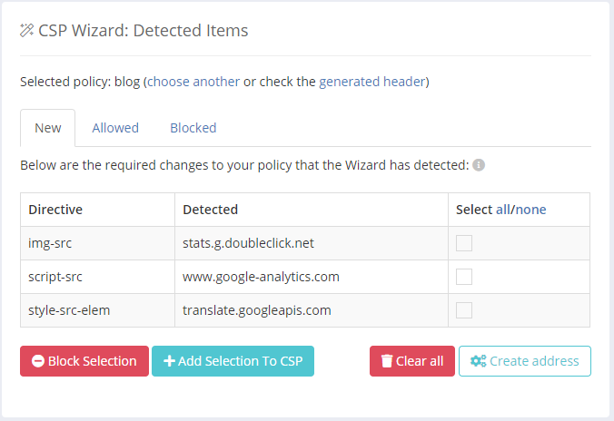
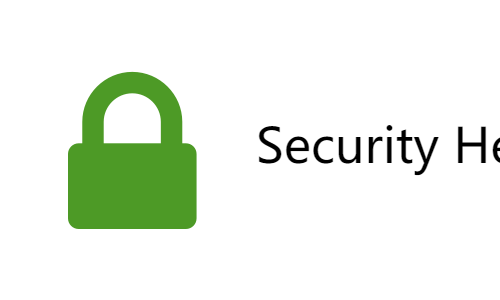

本站是部署在 Netlify 上的静态 Blog，Netlify 提供了两种配置自定义响应头的 [方法](https://docs.netlify.com/routing/headers/ "Netlify 配置自定义响应头的方法")，这里我使用 `netlify.toml` 文件进行配置。


## Strict-Transport-Security(HSTS)


**HSTS** 也就是**HTTP严格传输安全**的英文缩写，从 [caniuse](https://caniuse.com/#search=HSTS "HSTS 浏览器支持情况") 可以看到大多数浏览器都支持这个响应头。

[维基百科](https://zh.wikipedia.org/wiki/HTTP严格传输安全 "维基百科对 HSTS 的介绍")：

> 网站可以选择使用 HSTS 策略，来让浏览器强制使用 HTTPS 与网站进行通信，以减少会话劫持风险。
>

Netlify 可以直接在域名设置里开启强制 HTTPS，开启后 HTTP 请求会被重定向到 HTTPS 请求，并且加上了一个 HSTS 响应头；不过，Netlify 添加 HSTS 响应头默认没有包括子域名，也没有添加 HSTS Preload，为了更安全，建议加入 HSTS Preload 列表。

在 `netlify.toml` 文件（没有就在网站根目录下创建一个）里面加入以下代码：

```toml:title=netlify.toml
[[headers]]

  for = "/*"

  [headers.values]
    Strict-Transport-Security = "max-age=63072000; includeSubDomains; preload"
```

然后你就可以前往 [这里](https://hstspreload.org/ "提交到 HSTS Preload 列表") 提交你的域名，HSTS Preload 审核的时间有长有短，提交后需要耐心等待。


## X-Frame-Options


**X-Frame-Options** 可以通过确保网站没有被嵌入到别人的站点里面，从而避免 **clickjacking** （点击劫持）攻击，[大部分浏览器](https://caniuse.com/#search=X-Frame-Options "X-Frame-Options 浏览器支持情况") 都能很好的支持这个响应头。

这个响应头支持三种配置值：

- `DENY`：表示该页面不允许在 frame 中展示，即便是在相同域名的页面中嵌套也不允许
- `SAMEORIGIN`：表示该页面可以在相同域名页面的 frame 中展示
- `ALLOW-FROM uri`：表示该页面可以在指定来源的 frame 中展示

注意最后一种用法目前很少有浏览器支持。

在 `netlify.toml` 文件的 `[headers.values]` 下面加入一行：

```toml:title=netlify.toml {7}
[[headers]]

  for = "/*"

  [headers.values]
    Strict-Transport-Security = "max-age=63072000; includeSubDomains; preload"
    X-Frame-Options = "DENY"
```


## X-XSS-Protection


**X-XSS-Protection** 响应头是用来防范 XSS 的，当检测到跨站脚本攻击 (XSS) 时，浏览器将停止加载页面。现代浏览器中默认都开启了 XSS 保护，并且可以使用更强大的 **Content-Security-Policy** 响应头进一步增强安全性。

所以，这个响应头主要是为尚不支持 CSP 的旧版浏览器的用户提供保护。开启后可以提升攻击难度，没有特别的理由，不要关闭它，聊胜于无嘛。

它也有几种配置：

- `0`：禁用 XSS 保护
- `1`：启用 XSS 保护
- `1; mode=block`：启用 XSS 保护，并在检查到 XSS 攻击时，停止渲染页面
- `1; report=reporting-URI`：启用 XSS 过滤，并在检查到 XSS 攻击时，浏览器将停止渲染页面并使用类似 CSP report-uri 指令的功能发送违规报告

注意最后一项配置仅 Chromium 内核浏览器支持。下面是一个示例：

```toml:title=netlify.toml {8}
[[headers]]

  for = "/*"

  [headers.values]
    Strict-Transport-Security = "max-age=63072000; includeSubDomains; preload"
    X-Frame-Options = "DENY"
    X-XSS-Protection = "1; mode=block; report=<url>"
```


## Expect-CT


**Expect-CT** 头请求浏览器检查该网站的证书是否出现在公共证书透明度日志之中，类似 [CAA 记录](https://letsencrypt.org/zh-cn/docs/caa/ "CAA 记录")，可以有效降低错误颁发证书的风险。

它有三种指令：

- `max-age`：Expect-CT 有效时间，单位为秒
- `report-uri="url"`：可选，配置发送违规报告的 url
- `enforce`：该指令会强制执行证书透明度政策，如果不合规将拒绝连接

添加 Expect-CT 也很简单：
```toml:title=netlify.toml {9}
[[headers]]

  for = "/*"

  [headers.values]
    Strict-Transport-Security = "max-age=63072000; includeSubDomains; preload"
    X-Frame-Options = "DENY"
    X-XSS-Protection = "1; mode=block; report=<url>"
    Expect-CT = "max-age=86400; enforce; report-uri='<url>'"
```


## Content-Security-Policy


**Content-Security-Policy** 允许控制页面可以加载哪些资源，减少 XSS 的发生。[CanIUse](http://caniuse.com/#feat=contentsecuritypolicy "CSP 浏览器支持情况") 上可以看到大多数主流浏览器（除了 Internet Explorer）都支持了 Content-Security-Policy。

CSP 配置比较复杂，我使用了 **Report URI** 的 CSP 向导来生成配置。点击 [这里](https://report-uri.com/ "Report URI 网站") 注册一个账号，免费计划可以每月获取 10000 次报告，监控三个站点，保留 90 天报告数据，对于一个 Blog 来说完全够了。

注册后你会得到一个用来接收报告的 url，你可以换一个好看的子域名。在 `netlify.toml` 文件的 `[headers.values]` 下面加入一行（注意替换 `{subdomain}` 为你自己的子域名）：
```toml:title=netlify.toml {10}
[[headers]]

  for = "/*"

  [headers.values]
    Strict-Transport-Security = "max-age=63072000; includeSubDomains; preload"
    X-Frame-Options = "DENY"
    X-XSS-Protection = "1; mode=block; report=<url>"
    Expect-CT = "max-age=86400; enforce; report-uri='<url>'"
    Content-Security-Policy-Report-Only: default-src 'none'; form-action 'none'; frame-ancestors 'none'; report-uri https://{subdomain}.report-uri.com/r/d/csp/wizard
```

上面的 CSP 政策是「仅报告」，所以它不会对网页造成什么影响，可以放心添加。然后当你的网页被访问的时候，浏览器会发送一些「违规资源信息」给 Report URI，可以在 [这里](https://report-uri.com/account/wizard/csp/ "CSP 向导") 看到。

这些「违规资源」有些是网站需要的，比如 Google Analytics，你可以选择将它加入到 CSP 中，然后打开 [我的 CSP 政策](https://report-uri.com/account/policies/csp/ "我的 CSP 政策")，用生成的 CSP 策略替换掉原来的 `default-src 'none'; form-action 'none'; frame-ancestors 'none'`。



Report URI 建议至少运行 CSP 向导 7 天，以确保覆盖所有流量和用户，如果没有继续收到新的「违规资源」，就可以将 CSP 策略更改为「执行」。
```toml:title=netlify.toml {10}
[[headers]]

  for = "/*"

  [headers.values]
    Strict-Transport-Security = "max-age=63072000; includeSubDomains; preload"
    X-Frame-Options = "DENY"
    X-XSS-Protection = "1; mode=block; report=<url>"
    Expect-CT = "max-age=86400; enforce; report-uri='<url>'"
    Content-Security-Policy: default-src 'none'; form-action 'none'; frame-ancestors 'none'; report-uri https://{subdomain}.report-uri.com/r/d/csp/enforce
```

此外，你还可以使用 [CSP Evaluator](https://csp-evaluator.withgoogle.com/ "CSP Evaluator") 或 [Report URI](https://report-uri.com/home/analyse "Report URI") 来评估你的 CSP 策略是否安全。

这里再放两个 CSP 手动生成器：

https://report-uri.com/home/generate

https://www.cspisawesome.com/


## Feature-Policy


**Feature Policy** 是一个还在实验阶段的功能，用来启用或禁用某些浏览器功能和 API，以提高安全性和隐私性。它的配置和 CSP 类似。

指令值：

- `*`：允许当前页面使用该功能以及其中的任何嵌套浏览上下文，如 iframe
- `'self'`：允许当前页面使用该功能和任何位于同一源的嵌套浏览上下文，例如 iframe
- `'none'`：不允许使用该功能
- `<origin(s)>`：只允许指定的源使用此功能

下面贴一个我的配置：

```toml:title=netlify.toml {11}
[[headers]]

  for = "/*"

  [headers.values]
    Strict-Transport-Security = "max-age=63072000; includeSubDomains; preload"
    X-Frame-Options = "DENY"
    X-XSS-Protection = "1; mode=block; report=<url>"
    Expect-CT = "max-age=86400; enforce; report-uri='<url>'"
    Content-Security-Policy: default-src 'none'; form-action 'none'; frame-ancestors 'none'; report-uri https://{subdomain}.report-uri.com/r/d/csp/enforce
    Feature-Policy = "accelerometer 'none'; ambient-light-sensor 'none'; camera 'none'; gyroscope 'none'; magnetometer 'none'; microphone 'none'; payment 'none'; usb 'none'"
```

里面禁用了摄像头、麦克风、支付请求等浏览器功能，可以看到很多功能对普通的站点来说根本没必要，可以放心禁用。

Chromium 支持进行控制的功能清单可以看 [这里](https://source.chromium.org/chromium/chromium/src/+/master:third_party/blink/renderer/platform/feature_policy/feature_policy.cc;drc=ab90b51c5b60de15054a32b0bd18e4839536a1c9;l=138?originalUrl=https:%2F%2Fcs.chromium.org%2Fchromium%2Fsrc%2Fthird_party%2Fblink%2Frenderer%2Fplatform%2Ffeature_policy%2Ffeature_policy.cc "Chromium 支持进行控制的功能清单")。


## 检测响应头安全性


最后，你可以用 [这个](https://securityheaders.com/ "检测响应头安全性") 在线工具检测站点响应头的安全性，配置了上述的响应头应该可以拿到满分啦。



------

参考链接：

- [Content-Security-Policy Header](https://content-security-policy.com/ "Content-Security-Policy Header")
- [Introduction - Content Security Policy](https://csp-collector.appspot.com/docs/index.html "Introduction - Content Security Policy")
- [一些安全相关的HTTP响应头](https://imququ.com/post/web-security-and-response-header.html "一些安全相关的HTTP响应头")
- [Hardening your HTTP response headers](https://scotthelme.co.uk/hardening-your-http-response-headers/ "Hardening your HTTP response headers")
