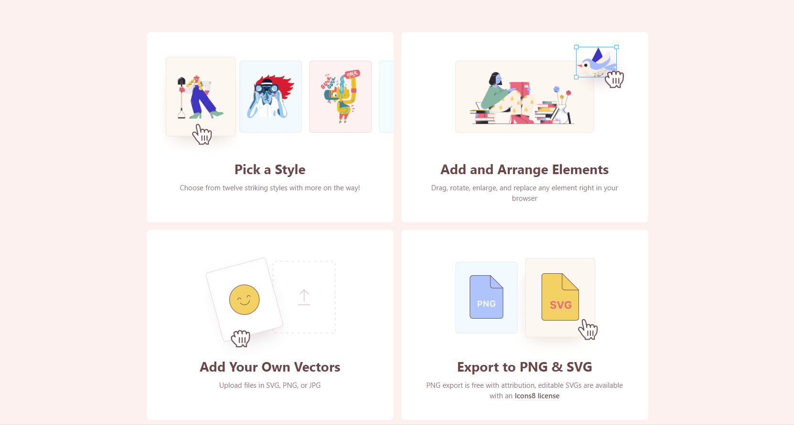
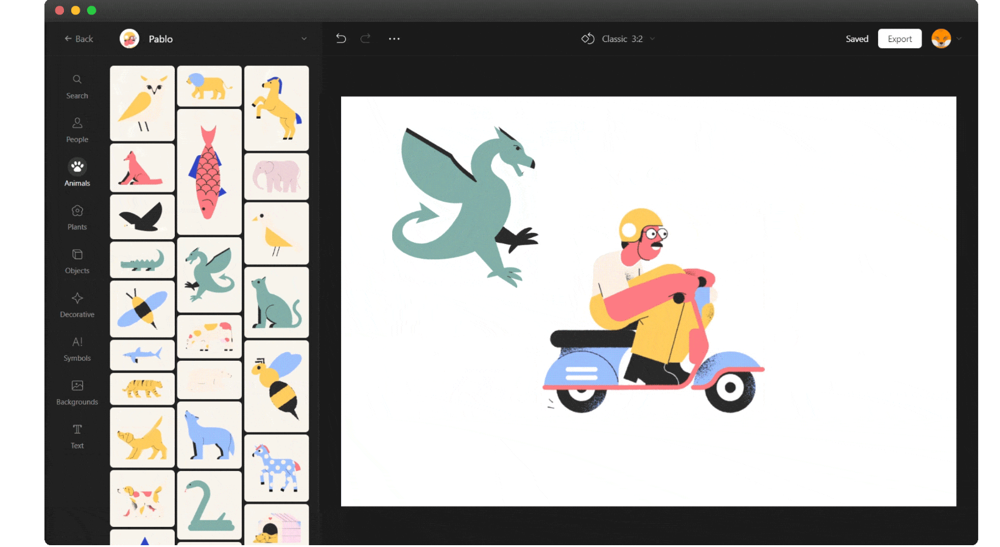
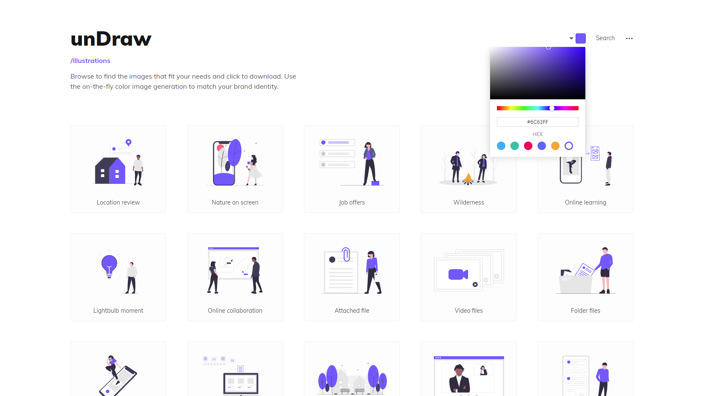
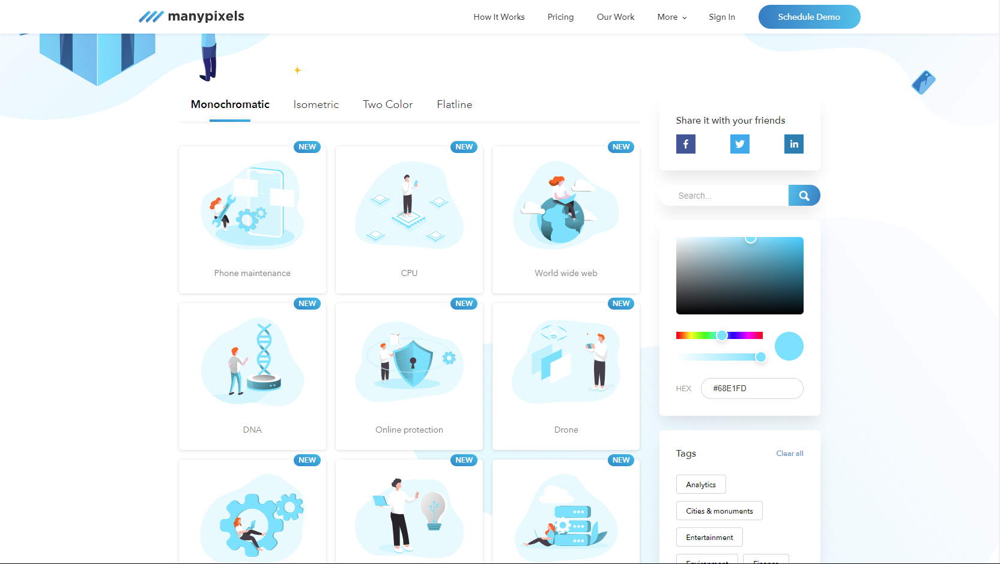
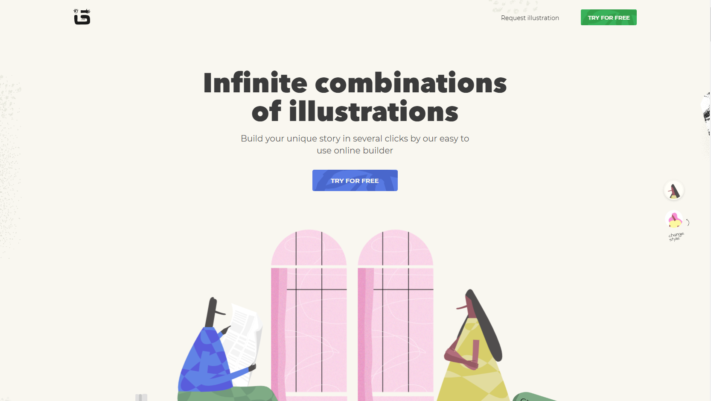
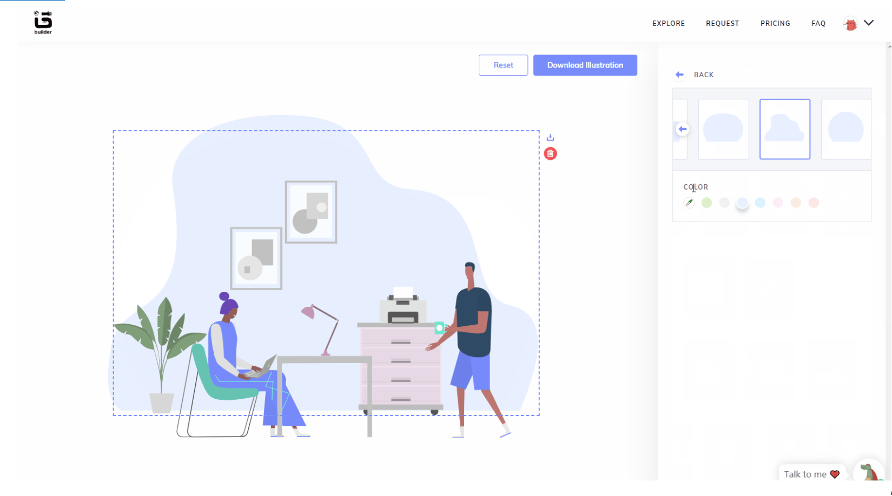
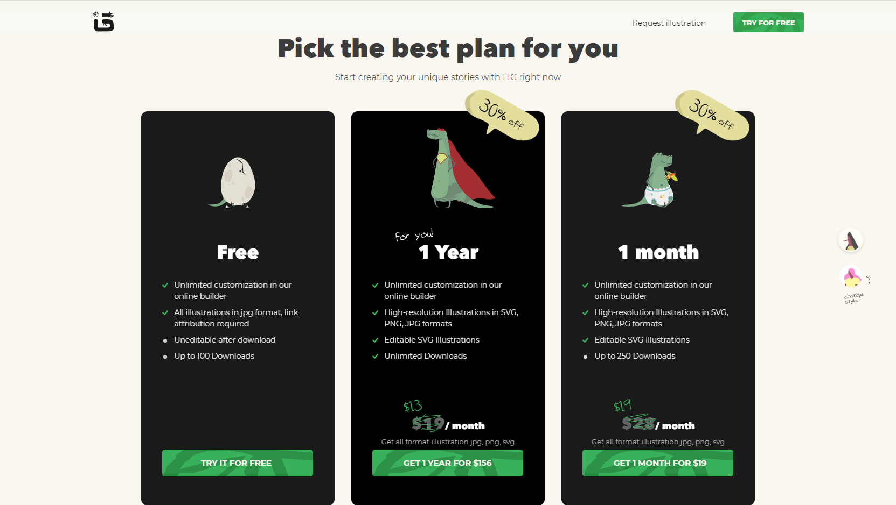
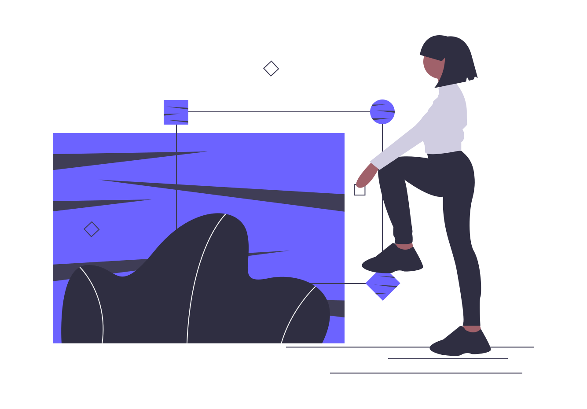

有时候写文章、产品说明或 PPT 时会用到插图，好看又合适的插图可以为项目增光添彩。

最有效率的方法当然是直接去插图素材库找到好看的插图，下载后使用。然而你可能想获得更有个性化的插图，那么就收下这些可以在线 DIY 定制的免费矢量插图素材库，用这些插图素材让你的项目更充实吧！

下面介绍的素材库都可以免费下载，支持在线自定义插图的颜色、元素、背景等；插图内容涵盖了各种类型，采用平面化设计。

## [Stories *by Freepik*](https://stories.freepik.com/)

](stories-by-freepik.png)

### 亮点

#### 可自定义更改插图颜色

可任意选择一种预设插图颜色，也可以使用颜色选择器，还可以直接输入 RGB 或十六进制值。

#### 可自定义插图背景

- 隐藏：插图不使用任何背景（现有的四种插图样式都支持这个选项）
- 简单：插图显示简单的背景（仅 Rafiki、Bro 和 Pana 样式支持）
- 详细：插图显示更详细的背景（仅 Rafiki 和 Pana 样式支持）

#### 可以自定义隐藏插图中的元素

选中一个插图时，右侧会有一个图层列表。这些图层对应插图中的不同元素，你可以选择要保留的图层，并隐藏不需要的图层。要隐藏任何元素，只需单击列表上其名称旁边的眼睛按钮即可。

](stories-by-freepik-gif.png)

#### 插图动画化

重头戏来了，这是我最喜欢的一点，**Stories *by Freepik*** 可以让插图动起来，获得更丰富的视觉效果。

点击选定插图的「Animate it」按钮，进入动画编辑页面，动画同样是可以 DIY 定制的：

](stories-by-freepik-animation.png)

##### 设置插图元素进入效果

- 淡入：元素逐渐出现在屏幕上
- 向上滑动：元素向上滑动时出现在屏幕上
- 向下滑动：元素向下滑动时出现在屏幕上
- 向左滑动：元素从左侧滑动时出现在屏幕上
- 向右滑动：元素从右侧滑动时出现在屏幕上
- 放大：元素随着大小的增大而出现在屏幕上
- 缩小：元素随着大小的缩小而出现在屏幕上
- Light Left：该元素从左侧进入，颤动并保持在原位
- Light Right：该元素从右侧进入，颤动并保持在原位

###### 给插图入场动画设置缓动类型

- Toon
- Linear（线性）
- Ease-in（淡入）
- Ease-out（淡出）

###### Animate children

可以给所选元素的不同部分分别进行入场动画处理。

##### 设置插图元素循环播放的动画效果

可设置的效果有：

- Shake
- Spin
- Floating
- Heartbeat
- Wind

##### 其他插图动画化配置项

- **持续时间：**可以以秒为单位设置插图动画持续时间
- **延迟：**可以设置插图动画开始之前延迟的秒数

此外，如果你看着如此繁多的设置选项却没有灵感，它还贴心地设置了一个「随机」按钮。

### 插图类型

每个 Tag 对应的插图都有四种风格（我感觉都差不多，只是配色不同）：

- Rafiki
- Bro
- Amico
- Pana

### 插图价格

完全免费，但必须注明来源。

> We recommend placing ‘Illustration by Stories by Freepik’ next to the illustrations that is being used and a link to [our website](https://stories.freepik.com/). If you can’t add it next to the image, you can place it in the footer of your website, blog or newsletter.

### 插图支持的导出类型

静态插图支持以 SVG 或 PNG 格式下载。动画化的插图则提供了相应的  HTML 代码，有延迟加载、即时加载等方式；也可以导出为 GIF 或 MP4 视频。

## [VECTOR CREATOR](https://icons8.com/vector-creator/)

### 亮点

#### 自定义更改插图元素颜色

可以使用颜色选择器，或者直接输入十六进制值。含多种颜色的元素可以精细到调整每一种颜色。

#### 强大又易用的插图编辑器

轻松拖动即可添加、移动插图的元素，可以左右上下翻转、调整图层，编辑器可以撤销、重复操作，画布尺寸也可以自定义编辑，默认还预置了 Twitter、Facebook 等图片尺寸。此外，它还支持自己上传图片作为一个元素。

### 插图类型

有人物、动物、植物等类别的元素，而且每种类型的插图还有不同的风格，风格比 **Stories *by Freepik*** 多，数量上感觉和 **Stories *by Freepik*** 差不多。

### 插图价格及支持的导出类型

无需注册即可免费设计并下载 PNG 格式的插图，如果需要下载 SVG 需要每月支付 ＄19.90。

不付费使用时需要遵循免费使用条款：

> **Share** — copy and redistribute the material in any medium or format.
>
> **Adapt** — remix, transform, and build upon the material for any purpose, even commercially.
>
> **Attribution** — you must give appropriate credit, provide a [link to the license](https://icons8.com/license), and indicate if changes were made. You may do so in any reasonable manner, but not in any way that suggests the licensor endorses you or your use.
>
> **No additional restrictions** — you may not apply legal terms or technological measures that legally restrict others from doing anything the license permits.

## [unDraw 插图库](https://undraw.co/)

### 亮点

#### 自定义更改插图颜色

可任意选择一种预设颜色，也可以使用颜色选择器，还可以直接输入十六进制值。

### 插图类型

所有的插图都是同一种风格。该项目于 2017 年推出，直到现在已经积累了很丰富的插图。

### 插图价格及支持的导出类型

完全免费，可以在任何商业或个人项目中使用这些插图，并且无需注明出处。unDraw 插图库中所有的插图都支持以 PNG 和 SVG 格式下载。

## [Manypixels 插图库](https://www.manypixels.co/gallery/)

可以说是另一个版本的 **unDraw** 插图库。同样支持自定义更改插图颜色，以 PNG 和 SVG 格式下载，完全免费，可以将这些插图用于任何商业或个人项目中，并且无需注明出处。**Manypixels** 插图库提供了四种风格的插图供选择。

## [ITG.digital 插图生成器](https://itg.digital/)

### 亮点

#### 自定义插图颜色

可任意选择一种预设颜色，也可以使用颜色选择器，或者直接输入十六进制值。

#### 自定义插图元素

ITG.digital 插图生成器可以说是既有一些局限性，也保留了一定的自由度。

可以移除元素、更改插图中的元素。但是不能进行自由地拖拽，在每一张插图中，每个元素的位置是固定的，而且每个位置的元素只能从预置的几个替代元素中进行替换。

有些元素又可以拆分为若干个子元素，每个子元素同样可以自定义颜色、替换等。

#### 插图类型

目前有五种插图风格，和 Stories *by Freepik* 不同的是，ITG.digital 插图生成器没有为每个 Tag 都提供几种风格的插图，而是定好风格后自由发挥。

#### 插图价格及支持导出的类型

ITG.digital 插图生成器需要注册账户才能生成插图，免费计划仅能导出为 JPG 格式，只能下载 100 次插图，并且使用时需要链接到网站；付费计划为 ＄28/month 或 ＄228/year（目前由于疫情原因提供了 30% 的折扣），可以下载 SVG，PNG，JPG 格式，月付计划每月最多 250 次下载，年付计划可以无限次下载。

## 总结

在以上 5 个免费矢量插图素材库中，**VECTOR CREATOR** 无疑是最易用的，不需要下载任何软件即可轻松做出个性化极高的插图；**Stories *by Freepik*** 的插图动画化功能很有意思，而且支持导出的格式也挺多；**unDraw** 和 **Manypixels** 插图库虽然只能自定义颜色，但是插图多而且完全免费使用；**ITG.digital** 插图生成器是一个新出不久的插图库，里面的插图确实非常精美，也有相当的可定制性，不过付费计划价格相对更昂贵一些。

本文亦发布于[「少数派」](https://sspai.com/post/60293)，因 Blog 主题原因，文中原有动图已更换为 Png 格式，可前往少数派查看动图。