之前一直想给自己的 Blog 整一个邮件订阅服务，正好可以试试 Power Automate。

**[Power Automate](https://flow.microsoft.com/zh-cn/)** 是一项自动化服务，以前叫做 **Microsoft Flow**，可以在应用程序和服务之间创建自动化的工作流，以同步文件，获取通知，收集数据等。类似的自动化服务还有 [**IFTTT**](https://ifttt.com/)、[**Zapier**](https://zapier.com/)、**[Integromat](https://www.integromat.com/)**、[**n8n**](https://n8n.io/) 等。

大致流程：

1. 利用 Microsoft Forms 收集订阅者的邮箱地址
2. 创建一个 RSS 触发器，Blog 更新时自动运行工作流
3. 检索 Microsoft Forms 已经记录的邮箱并发送邮件

------

##  创建订阅表单

Microsoft Forms 创建出的表单本质上是一个 `.xlsx` 文件。这里有个容易踩坑的点，如果你直接在 [Microsoft Forms Web](https://forms.office.com/) 创建表单的话，下一步你可能找不到创建出来的表单所在的存储位置。

更好的方法是在 Onedrive 里面创建：

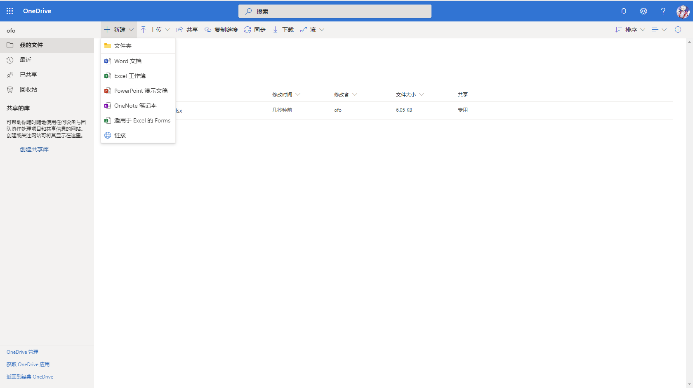

1. 转到你想要保存订阅表单的文件路径下
2. 点击「新建」
3. 新建一个「适用于 Excel 的 Forms」

创建完成后会自动跳转到 Microsoft Forms 进行编辑，我们在表单里设置一个问题来收集订阅者的邮箱。

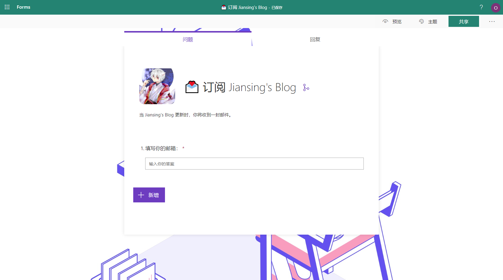

注意在设置里打开「具有链接的所有人均可回复」。

## 配置 Power Automate 工作流

**[Power Automate](https://flow.microsoft.com/zh-cn/)** 可以使用 Microsoft 账号直接登录，你也可以用邮箱注册一个账号。Power Automate 可以免费试用（使用？）。

> 任何人都可以注册并获得 Power Automate 的免费计划。如果您的组织已为您购买了 Office 365 或 Dynamics 365，则可以访问 Power Automate 的其他功能。如果您想使用付费功能，还可以开始 90 天免费试用，或购买 Power Automate Plan 1 或 Plan 2。

1. 进入 Power Automate，点击「创建」，创建一个「自动化流」，此外，它还提供了「即时流」、「计划流」以及「业务流程流」。

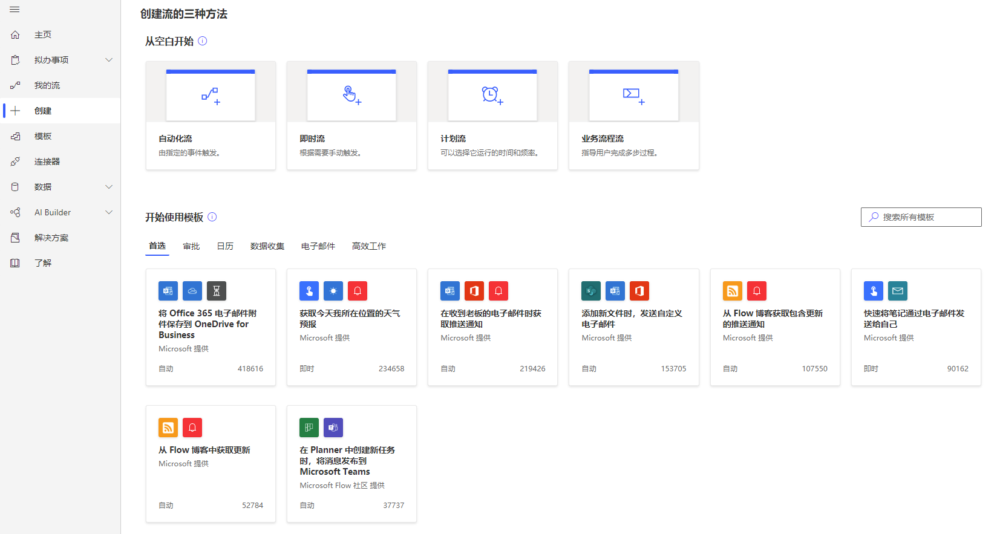

2. 搜索「RSS」可以找到这个触发器，选择它并点击「创建」。

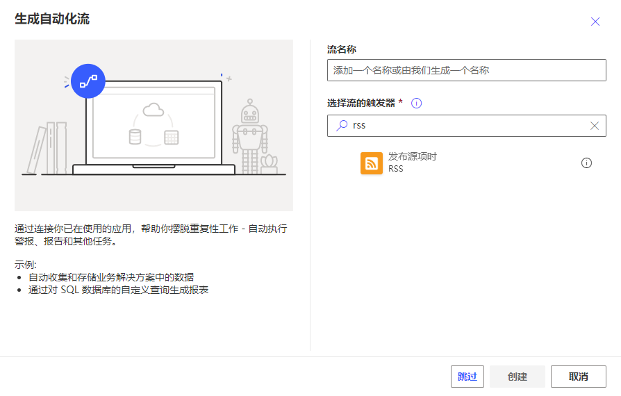

3. 输入 RSS 的链接。接下来点击「+新步骤」，搜索操作「Get rows」并添加。（后文附搜不出的解决方法）

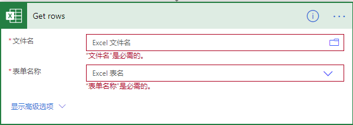

第一次使用 Excel Online 相关操作需要登录授权。与 IFTTT 不同的是，IFTTT 每一种服务只能连接一个账号，而 Power Automate 的每一种服务都可以连接到多个账号。

文件选取刚刚创建的 Forms（后缀为 `.xlsx`）。

4. 再创建一个步骤，选择「控件」，创建「应用到每一个」控件。

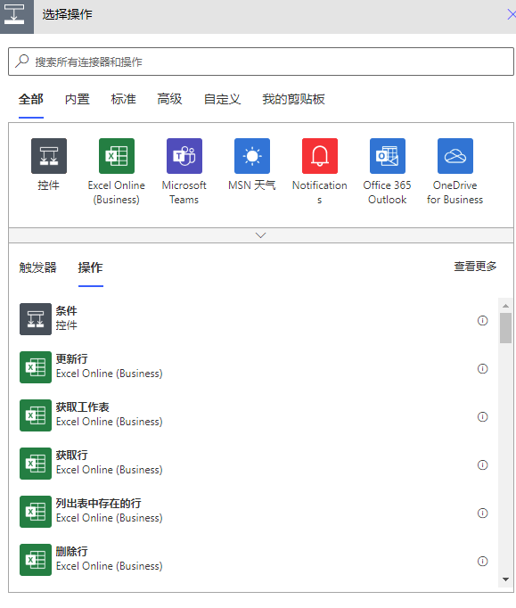

5. 接下来在「输出」里面「添加动态内容」，点击「Get rows」的 `value`。「动态内容」就相当于一个个变量。

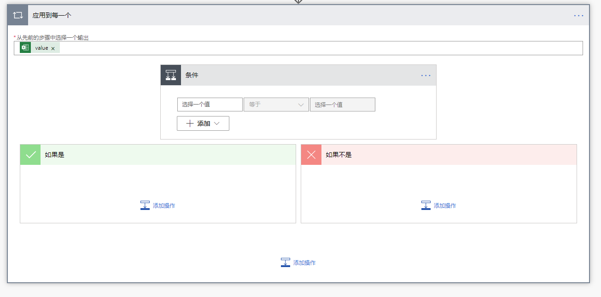

6. 然后点击「应用到每一个」控件里面的「添加操作」，创建一个「条件」控件。因为表单里面可以填写任意文本，所以这里我们做一个简单的筛选。

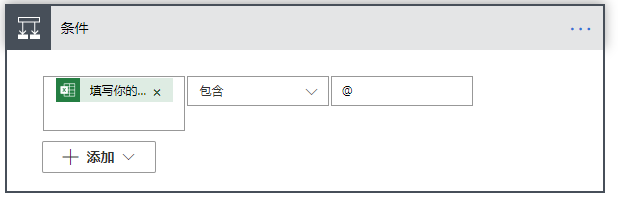

7. 在「如果是」控件里面添加一个「发送电子邮件」操作，除 Outlook 外，Power Automate 还支持 Gmail 等邮件服务。

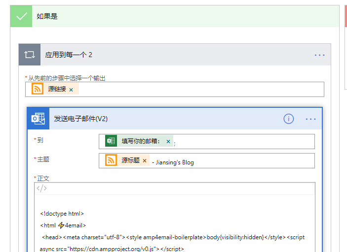

8. 「到」里面「添加动态内容」，选取「Get rows」的「填写你的邮箱：」并加上 `;` 。注意这是我的表单上设置的问题，请选取你自己设置的问题提示文本。不要选择「电子邮件」，因为当 Microsoft Forms 设置为「具有链接的所有人均可回复」时，「电子邮件」这一项的值是空的。

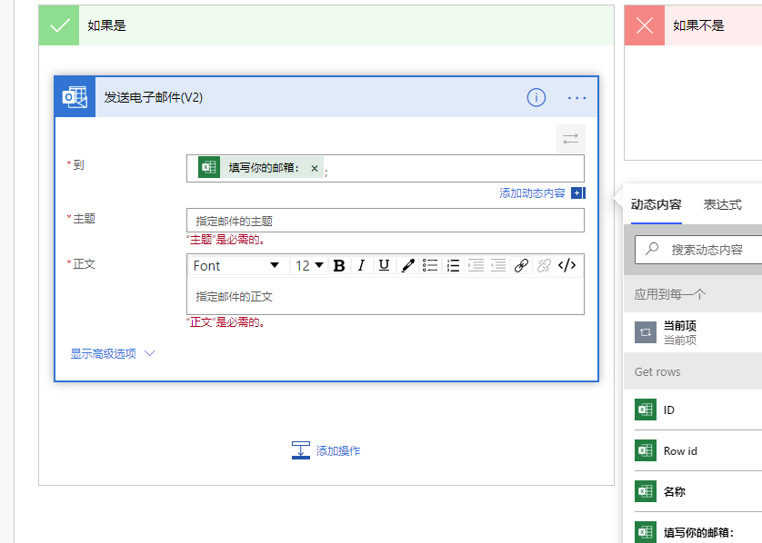

9. 接下来编辑一份邮件模板，注意用上 RSS 的「动态内容」。这里提供了一个邮件编辑器，也可以使用 Html。

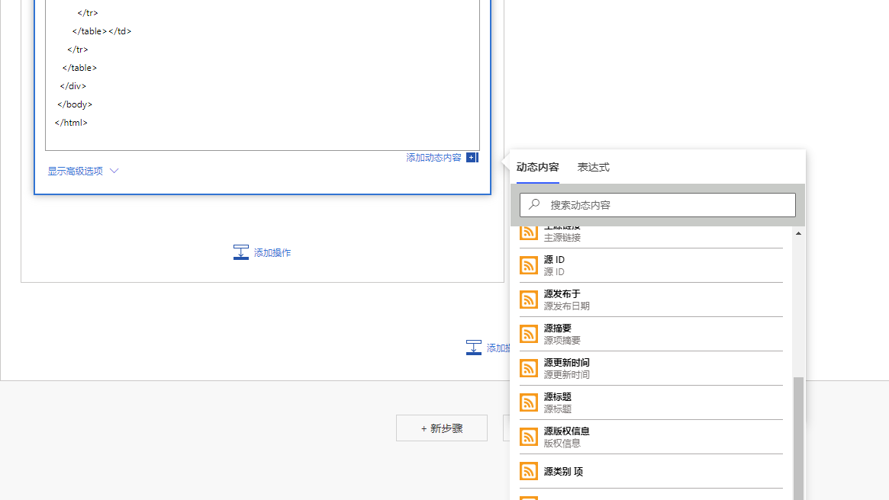

至此，一个简单的 RSS 邮件订阅系统就构建完成啦。你可以点击右上角「测试」来看看能否正常运行。第一次测试需要自己执行触发器操作（在 Blog 上发一篇测试文章以更新 RSS），下次测试就可以直接使用第一次的数据进行重复测试。

## 踩坑的点

### 为什么不用「获取行」（中文界面显示的操作名称）？

一开始我使用的就是「获取行」，从名称来看，功能似乎是一样的，但是却要求输入「密钥值」。

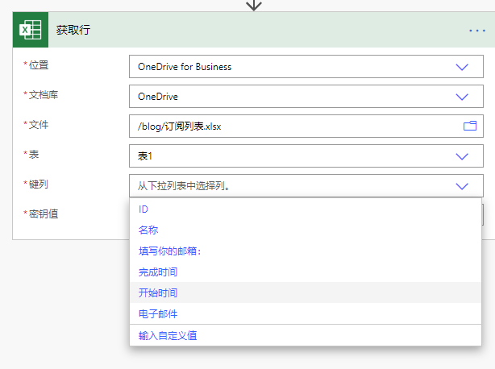

后来看到在 Power Automate 的英文文档里面，`Key Value` 只在「Delete a row」、「Get a row」以及「Update a row」操作中才需要，所以「获取行」实际上是「获取**一**行」。

### 搜不出「Get rows」？

我也搜不出「Get rows」。😢

但是这个操作是实际存在的，比如下面这个 Power Automate 模板，里面就使用了这个操作。那么怎么添加到自己的工作流里呢？

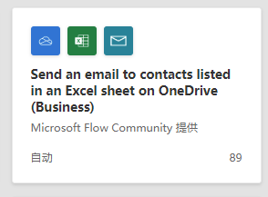

这里要先提一提 Power Automate 一个非常好用的功能：「复制到剪切板」

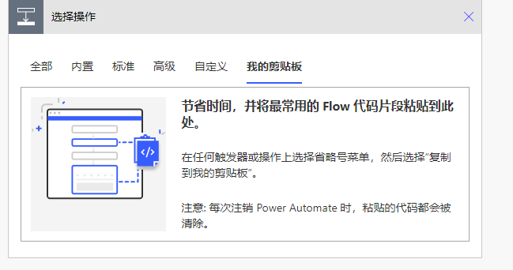

在 Power Automate 主页搜索这个模板：`Send an email to contacts listed in an Excel sheet on OneDrive (Business)`

然后就可以将「Get rows」搬过来了。

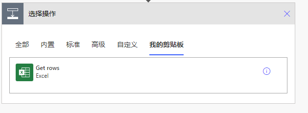

## 总结

可以看到在我们的工作流中真正关键的只有 4 个步骤，并不算复杂。这个工作流除了给 Blog 的订阅者使用，也可以拿来订阅任何我们感兴趣的 RSS 源。甚至你可以自己搭建一个类似 [RSSMailer](https://rssmailer.app/) 的服务。（[RSSMailer – 用邮箱接收每日 RSS 更新，RSS 阅读器](https://www.appinn.com/rssmailer/)）

目前我们建立的邮件订阅服务还很简单，后续将加上退订之类的功能。

### Power Automate 是另一个 IFTTT 吗？

Power Automate 目前可以连接 [336](https://asia.flow.microsoft.com/zh-cn/connectors/) 项服务，大多是 Microsoft 自家的产品，数量上远远比不上 IFTTT （目前 IFTTT 可以连接 [1254](https://ifttt.com/services) 项服务）。

不过 IFTTT 的 applets 只能配置简单的条件判断，而且不是开发者账号不能在一个 applet 里连接多项服务；相比之下，Power Automate 除了可以连接多项服务外，同一个服务还能连接到不同账号，而且，Power Automate 的配置也比 IFTTT 精细得多。

如果你只需要每天来一条天气提醒的话，大可不必使用 Power Automate 如此复杂的工具；但是如果是文件处理之类的任务，Power Automate 显然要比 IFTTT 更有优势。

最后，放上本博客的邮件订阅表单，欢迎大家订阅！

<iframe width="640px" height= "480px" src= "https://forms.office.com/Pages/ResponsePage.aspx?id=kcPln2rvYECihBM-wWWyXI8J__ppir5IuDSVWjrpe1FUMkpCSkJWR1FBSTM3SVU3QTVESDIxUEJaQi4u&embed=true" frameborder= "0" marginwidth= "0" marginheight= "0" style= "border: none; max-width:100%; max-height:100vh" allowfullscreen webkitallowfullscreen mozallowfullscreen msallowfullscreen> </iframe>